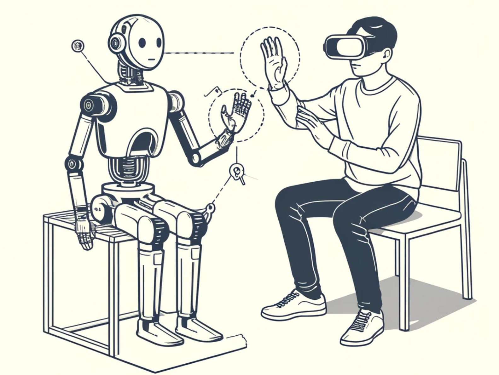

<p align="center">
  <picture>
    
  </picture>
</p>

<div align="center">

[](https://github.com/kscalelabs/teleop/blob/master/LICENSE)
[](https://pypi.org/project/kscale-onshape-library/)
[](https://discord.gg/k5mSvCkYQh)
[](https://humanoids.wiki)

</div>
<h1 align="center">
    <p>Bi-Manual Remote Robotic Teleoperation</p>
</h1>
<p align="center">
  <picture>
    
  </picture>
  <br/>
  <picture>
    
  </picture>
  <br/>
</p>

---

A minimal implementation of a bi-manual remote robotic teleoperation system using VR hand tracking and camera streaming.

✅ VR and browser visualization

✅ bi-manual hand gesture control

✅ camera streaming (mono + stereo)

✅ inverse kinematics

✅ Meta Quest Pro HMD + NVIDIA® Jetson AGX Orin™ Developer Kit

✅ `.urdf` robot model

✅ 3dof end effector control

✅ tested on real world robot

✅ record & playback trajectories

⬜️ debug 6dof end effector control


### Setup

```bash
git clone https://github.com/kscalelabs/teleop.git && cd teleop
conda create -y -n teleop python=3.11 && conda activate teleop
make install-dependencies
pip install -r requirements.txt
```

### Scripts
```demo.py``` - POC for integrating PyBullet with Vuer for real-time robot control

```collect.py``` - Data collection script that interfaces with demo.py for video and position collection

### Usage

Start ngrok on the robot computer.

```bash
ngrok http 8012
```

Open the browser app on the HMD and go to the ngrok URL (there will not be any content until you start the server on the robot computer).

#### Teleop
Start the server on the robot computer.

```bash
python demo.py --gui --firmware
```

#### Data Collection
Start the server on the robot computer.

```bash
python collect.py --task_name CONFIG_TASK_NAME --use_firmware True
```

#### Replaying Trajectories
Simply run the following command to replay the recorded trajectories. This currently only works with episodes split into hdf5 and mp4 files.

```bash
python replay.py --dataset_dir PATH/TO/DATASET --episode_idx EPISODE_IDX
```

### Common Issues
#### Large Errors in Robot State and Actions
Check the units, offsets, and any other factors that might be causing the numbers being recorded to be different than you expect. Also, check that the motor configs are correct (signs, offsets, etc). The Robot class has a handy method to test motors. 

```python
robot.test_motors()
```

#### Robot Not Moving
Check that the robot is connected to the firmware and that the firmware is running. Check the status of the can bus and restart if needed.

  ```bash
  sudo ip link show can0
  ```

#### Jerky Robot Movement
Depending on your setup (power supply, battery, etc), check that current draw is not too high. An abnormally high current draw is also indicative of large errors in motor state and actions since we are using a closed loop PD torque controller. 

### Dependencies

- [Vuer](https://github.com/vuer-ai/vuer) is used for visualization
- [PyBullet](https://pybullet.org/wordpress/) is used for IK
- [ngrok](https://ngrok.com/download) is used for networking


### Citation

```
@misc{teleop-2024,
  title={Bi-Manual Remote Robotic Teleoperation},
  author={KScale Labs},
  year={2024},
  url={https://github.com/kscalelabs/teleop}
}
```
